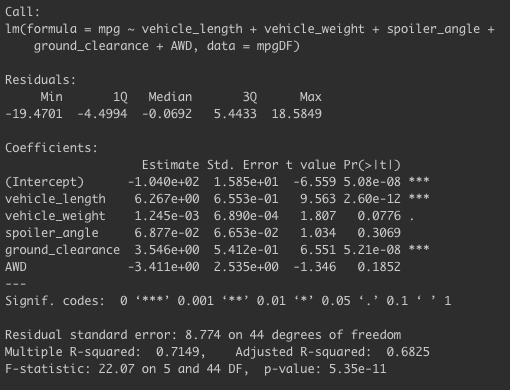
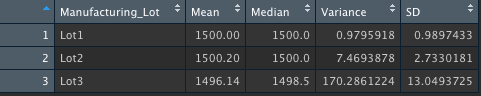
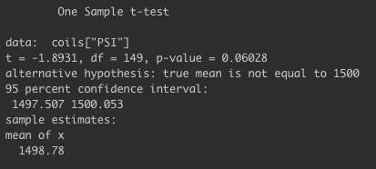
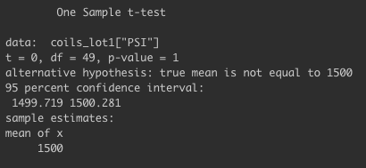
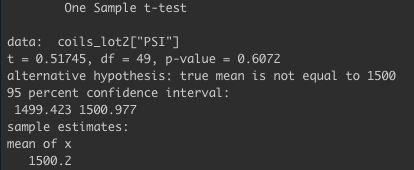
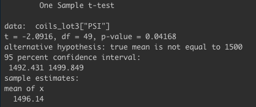

# MechaCar Statistical Analysis

## Linear Regression to Predict MPG

### Summary
- Performing a multiple linear regression on the data returns an r-squared value of 0.7149 and a p-value of 5.35e-11. The .71 r-squared value indicates that 71% of the of the variability is explained by the model, suggesting that the model is a good fit for the data. Additionally, since the p-value is below the assumed significance level of 0.05% we have evidence to support rejecting the null hypothesis.
- The variables that provide a no-random amount of variance to mpg are vehicle length and ground clearance. These variables have very small p-values meaning that the variables are unlikely to provide random amounts of variance to the model. This means that ground cleanrance and vehicle length most likely have a significant affect on gas mileage.
- The slope of this model is not considered to be zero. A slope of zero indicates that there is no significant relationship between the independent and dependent variables. Since there are variables that have statistically significant affects on mpg the slope would not be zero.
- The model should be able to effectively predict mpg of MechaCar prototypes because the high r-squared value and low p-values.

## Summary Statistics on Suspension Coils
### Total Summary

### Lot Summary

### Summary
- The analysis shows that for all lots the weight capacity for the coils has a mean of 1499 pounds per square inch (PSI) and a median of 1500 PSI. The close mean and median shows that the data is not skewed. Additioanlly the variance is 62 and the standard deviation is about 8. When looking at all of the lots, the manufacturer data falls within the specifications (variance is inder 100 at 62). However, when the lots are separated out it is clear that Lot 3 is underperforming compared to Lots 1 and 2. Looking at the individual lots, Lot 1 and 2 have a a closer mean and median (meaning an even smaller skew of data) and have smaller variance (1 and 7) and standard devations (1 and 2). Both Lots 1 and 2 meet the speficiation requirements since their variance is under 100. Lot 1 has the strongest data performance. However, lot 3 is struggling and it is not meeting the design specifications. Their coils havea a variance of over 170.

## T-Tests on Suspension Coils
### All Lot T-Test Summary

- The p-value is not below .05 (p = 0.06) so we are not able to reject the null hypothesis meaning that the sample mean is consistent with the hypothesis that the true population mean is 1500.

### Lot 1 T-Test Summary

- The p-value is not below .05 (p = 1) so we are not able to reject the null hypothesis meaning that the sample mean is consistent with the hypothesis that the true population mean is 1500.
### Lot 2 T-Test Summary

- The p-value is not below .05 (p = 0.6) so we are not able to reject the null hypothesis meaning that the sample mean is consistent with the hypothesis that the true population mean is 1500.
### Lot 3 T-Test Summary

- The p -value is below .05 (p = 0.04) meaning we would reject the null hypothesis that the true mean of this data subset is 1500.

## Study Design: MechaCar vs Competition
### Summary
- There has been a major shift towards fuel efficient cars as consumers are wanting to save money and the environment. A great place to start would be a statistical study comparing the city and highway fuel efficiency of the MechaCar prototypes to other similar vehicles on the market. The question I would seek to answer is: Does the MechaCar have a higher fuel efficiency than the average of other similar cars on the market?

### Hypothesis
- Hypothesis: If the MechaCar has higher fuel efficiency than other cars on the market, then it will get more miles per gallon in the city and highway than the industry average.
- Null Hypothesis: If the MechaCar does not have higher fuel efficiency than other cars on the market, then it will get the industry average or lower miles per gallon in the city and highway.

### Statistical Test
- The statistical test I would run would be to plot all the vehicles on a scatter plot with city mpg on the x axis and highway mpg on the y axis. I would then run a simple linear regressions to see the relationship between the two variables as well as see where the MechaCar is in relation to all the other vehicles.

### Required Data
- The required data would be a list of all vehicles that are similar to the MechaCar and their fuel efficiency, both the highway and city mpg.

